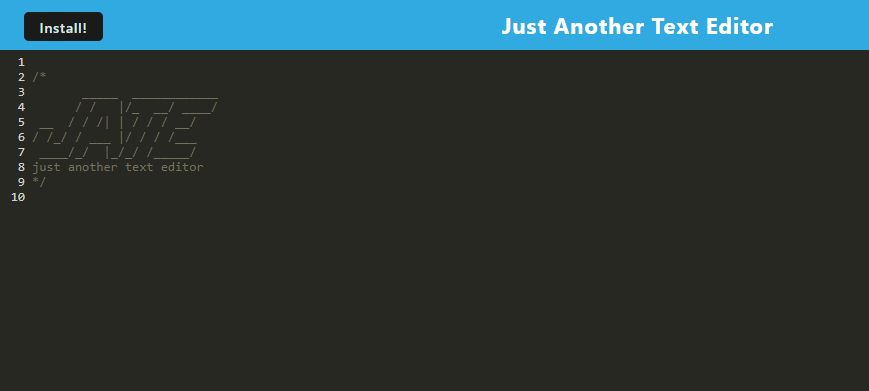

# PWA-Text-Editor

  

  ## Description

  This is PWA (Progressive Web Application) based Text Editor! Allows for online and offline text editing. This app can even be downloaded and run natively on your computer.
 
  ## Table Of Contents

  - [Screenshots](#screenshots)
  - [Link (Deployed Application)](#link)
  - [Installation](#installation)
  - [License](#license)
  - [Guidelines](#guidelines)
  - [Questions](#questions)

  ## Screenshots

  ## Link

https://afternoon-castle-19497.herokuapp.com/

  ## Installation

If you clone this repo and run it on your computer, you can install it doing the following in the terminal:

1) Type in npm i to install packages
2) Type in npm start
3) You are now free to use the PWA Text Editor, by default you would access it by typing http://localhost:3000/ into your browser

  
## License
    This work is licensed under Creative Commons Attribution 3.0 Unported License.
    https://creativecommons.org/terms#8

  ## Guidelines

  You are open to do with this code as you wish

  ## Questions

  This repo was created by https://github.com/BenBasic
  To contact me, please send an email to Benjamin@TreneonGames.com
